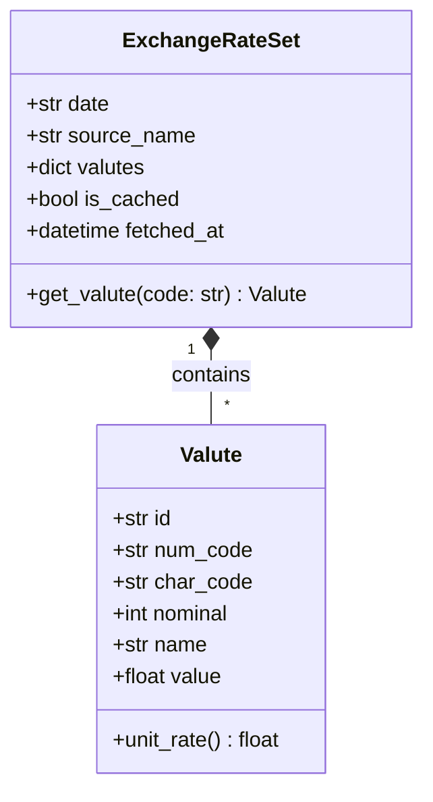

# Data Model: Desktop Currency Converter

## Entity Relationships



## Field Specifications

### Valute
- `id` (str): BNM internal ID (e.g., `"47"`, `"44"`).
- `num_code` (str): ISO 4217 numeric code (e.g., `"978"` for EUR, `"840"` for USD).
- `char_code` (str): ISO 4217 3-letter code (e.g., `"EUR"`, `"USD"`, `"MDL"`).
- `nominal` (int): Currency unit multiplier (e.g., `1`, `10`, `100`).
- `name` (str): Localized currency name (e.g., `"Евро"`, `"Доллар США"`).
- `value` (float): Exchange rate expressed in Moldovan Lei (MDL) for the given nominal.

### ExchangeRateSet
- `date` (str): Effective date formatted as `DD.MM.YYYY`.
- `source_name` (str): Human-readable source indicator (e.g., `"Национальный Банк Молдовы (BNM)"`).
- `valutes` (dict[str, Valute]): Keyed by uppercase `char_code`.
- `is_cached` (bool): `True` if loaded from local cache, `False` if fetched live.
- `fetched_at` (str): ISO timestamp of fetch/save.

## Cache File Schema (`cache/exchange_rates.json`)
```json
{
  "date": "23.09.2026",
  "source_name": "Национальный Банк Молдовы (BNM)",
  "fetched_at": "2026-09-23T20:30:00Z",
  "valutes": {
    "MDL": {
      "id": "0",
      "num_code": "498",
      "char_code": "MDL",
      "nominal": 1,
      "name": "Молдавский лей",
      "value": 1.0
    },
    "EUR": {
      "id": "47",
      "num_code": "978",
      "char_code": "EUR",
      "nominal": 1,
      "name": "Евро",
      "value": 20.1352
    }
  }
}
```
